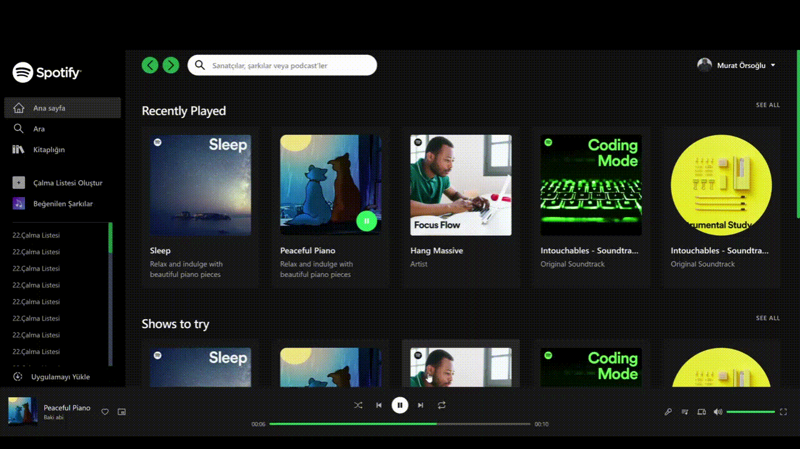

# Tailwind with React  

## What I Practice

 - `<Sidebar />` component
 -`tailwind` için `line-clamp`
 - For audio folders `react-use` 
 - For player range slider  `react-range` 
 - Lots of tailwind :)

### `Deploy` 

 https://spotify-clone-reactapp.netlify.app/

### `Screen`  

  
